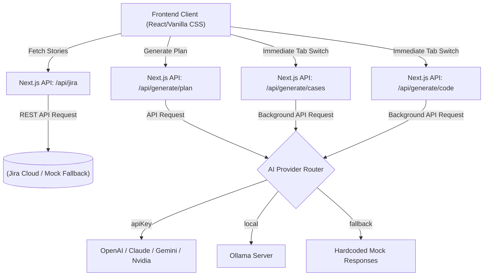
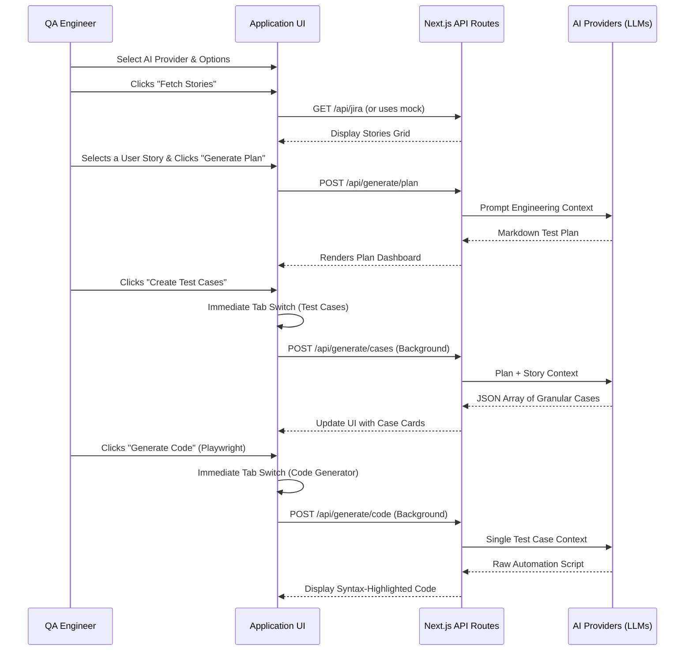

# Test Orchestrator - Project Presentation & Workflows

## Part 1: Presentation Slides (PPT Outline)
You can directly use this outline to create your PowerPoint presentation.

---

### **Slide 1: Title Slide**
**Title:** Test Orchestrator
**Subtitle:** Accelerating the QA Lifecycle with AI
**Speaker:** [Your Name/Title]

---

### **Slide 2: Project Overview**
**Title:** What is Test Orchestrator?
* **Core Concept:** An advanced, AI-powered web application that automates the entire Software Testing Lifecycle.
* **Key Capabilities:** 
  * Fetches User Stories dynamically from Jira.
  * Generates professional, structural Test Plans.
  * Creates granular, actionable Test Cases.
  * Generates immediately executable Automation Code.
* **Supported Frameworks:** Selenium (Java/Python), Playwright, and Cypress.

---

### **Slide 3: Technology Stack**
**Title:** Built with Modern Web Tech
* **Frontend:** Next.js (App Router) for an optimized and secure React application.
* **Styling:** Vanilla CSS highlighting modern, dynamic glassmorphism aesthetics without reliance on heavyweight utility frameworks.
* **Integration:** REST API migration for compatibility with modern Jira cloud configurations.

---

### **Slide 4: Core Features (1/2)**
**Title:** Features Designed for Speed
* **Jira Integration:** Seamless fetching of stories using custom recursive parsers to convert Jira Rich-Text into clean formats.
* **Test Plan Generation:** Multi-LLM pipeline analyzes stories to build comprehensive test strategies.
* **Smart Test Cases:** Granular test creation complete with Priority Badges (`High`, `Medium`, `Low`), and CSV download capabilities.

---

### **Slide 5: Core Features (2/2)**
**Title:** AI-Driven Code & Customization
* **Automation Code Generation:** One-click script creation with a Code History Map that persists generation history and supports cross-frameworks.
* **Multi-LLM Support:** Dynamic real-time connectivity to:
  * OpenAI, Anthropic, Google Gemini, Nvidia NIM.
  * 100% offline private execution with local Ollama.
* **Custom Prompt Mode:** Empowers QA leads to dictate the AI's exact behavior throughout the generation pipeline.

---

### **Slide 6: System Architecture**
**Title:** High-Level Architecture
* **Client-Side:** Next.js frontend interacting securely with AI APIs & Mock data.
* **Next.js Backend API:** Orchestrates endpoints (`/api/jira`, `/api/generate/plan`, `/api/generate/cases`, etc.).
* **AI Router Engine:** Decouples specific integrations allowing fallback logic gracefully when an endpoint is down.
*(See Workflow Diagram below to add to this slide)*

---

### **Slide 7: Roadmap & Next Steps**
**Title:** Future Enhancements
* Real-Time AI Streaming ("Typing Out" Effect)
* Multi-User Session Management & Authentication
* Test Coverage Heatmaps
* Bi-directional Jira Write-backs (Issue Creation)

---
---

## Part 2: Workflow Diagrams

To visualize your application, you can use the following diagrams in your presentation or documentation.

### 1. System Architecture Diagram

This diagram displays the high-level architecture of the application, showing how the frontend interacts with Next.js APIs, the Atlassian Jira Cloud, and various AI Providers.

### 2. Application Data Flow (Sequence Diagram)

This sequence diagram illustrates the step-by-step process a user takes inside the Test Orchestrator—from fetching a Jira story to generating execution-ready automated test code.

