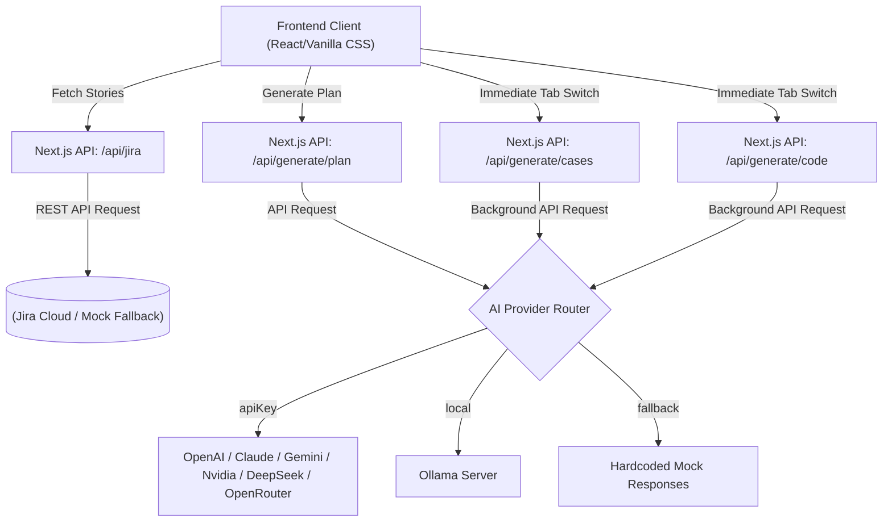
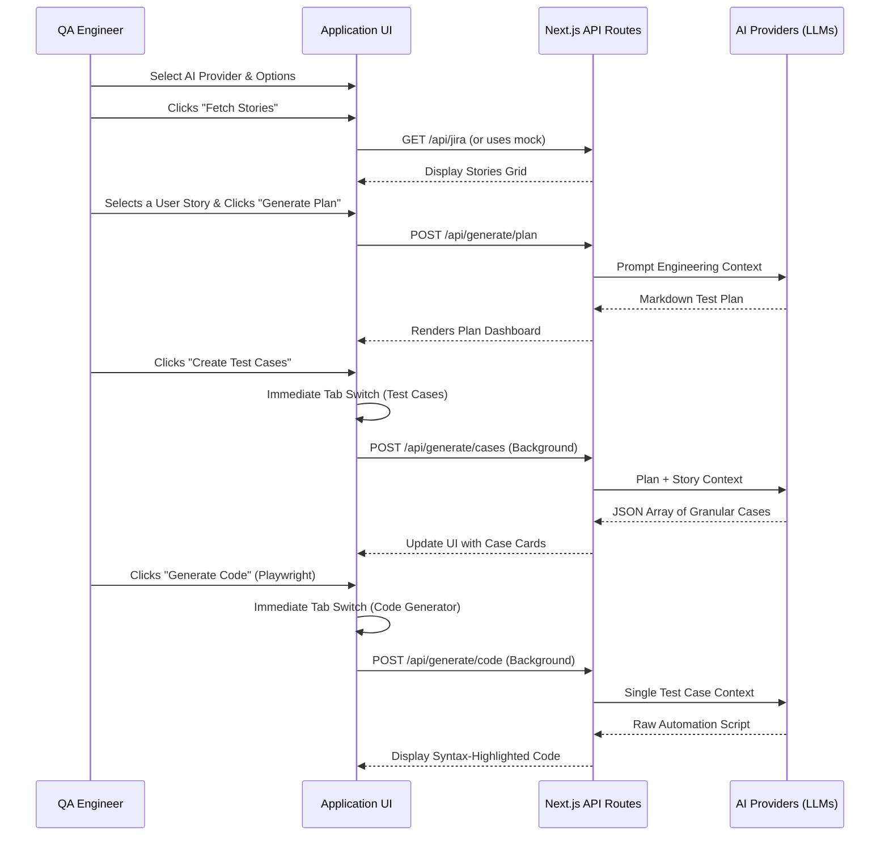

# 🎯 Test Orchestrator

**Test Orchestrator** is an advanced, AI-powered web application that automates the Software Testing Lifecycle. From fetching Jira User Stories to generating professional Test Plans, granular Test Cases, and immediately executable Automation Code (Selenium, Playwright, Cypress)—this tool accelerates QA processes seamlessly.

Built securely with **Next.js (App Router)** and styled entirely with **Vanilla CSS** (No Tailwind) to deliver a sleek, dynamic, glassmorphism UI.

---

## ✨ Core Features

1. **Jira Integration (Modern & Scalable)**
   - **Modern API Migration:** Uses the latest **POST `/rest/api/3/search/jql`** specification, ensuring compatibility with 2025+ Atlassian deprecations (avoiding the common `410 Gone` error).
   - **Rich-Text (ADF) Support:** Built a custom recursive parser to convert Atlassian Document Format (ADF) into clean Markdown, supporting bold text, bulleted lists, and headings for high-fidelity rendering.
   - **Story Detail Modal:** Click any story card to open a premium, centered modal with a **blurred backdrop (`backdrop-filter`)**, smooth animations, and full scrolling for long requirements.
   - **Acceptance Criteria Sniffer:** Dynamically maps custom Jira fields to identify and include "Acceptance Criteria" even if your Jira project uses custom field IDs.
   - **One-Click Flow:** Selecting "Generate Test Plan" in the Jira tab now **automatically triggers** the generation in the next step, removing redundant clicks.
   - **Demo Mode Alert:** If no Jira credentials are configured, a friendly info banner informs the user that sample mock stories are being used.
2. **AI-Powered Test Plan Generation**
   - Analyzes User Stories and constructs comprehensive test plans in professional Markdown format using a multi-LLM pipeline.
3. **Smart Test Case Generation & Export**
   - **Streamlined UX:** Clicking "Create Test Cases" now **immediately** transitions to the Test Cases tab with a high-fidelity **Skeleton Loader**, generating results in the background.
   - Breaks down the generated Test Plan into specific, actionable test cases with explicit steps and expected results.
   - **Priority Badges:** Each case is auto-labelled as `High`, `Medium`, or `Low` priority.
   - **Pagination:** Organizes cases (5 per page) for clear, focused viewing.
   - **Export All Info:** Copies all test cases to clipboard in formatted plain text.
   - **Download as CSV:** Exports cases to a format compatible with Jira, Excel, and other test management tools.
4. **Automation Code Generation with Code History Map**
   - **Cross-Framework Support:** Generates scripts for **Playwright**, **Selenium (Java/Python)**, and **Cypress**.
   - **Immediate Hand-off:** Clicking the "Generate Code" icon instantly switches to the **Code Generator** tab and begins the AI process in-place.
   - **Sub-Tab Navigation:** Persists all generated scripts in the current session. Switching between test cases in the Code Generator is instant and never loses previously generated code.
   - **Visual Feedback:** Test Case cards show a "✅ Code Generated" badge for cases that already have scripts.
5. **Live AI Provider Status & Multi-LLM Support**
   - Real-time connectivity indicator (🟢Online, 🟡Warning, 🔴Offline) for OpenAI, Anthropic, Google Gemini, Nvidia NIM, DeepSeek, OpenRouter, and Local Ollama.
6. **Custom Prompt Mode**
   - Toggle between 🤖 Default and 📝 Custom prompt modes to tailor the AI's behavior at every stage of the pipeline.
7. **Fully Responsive Workspace**
   - Optimized for all screen sizes with a **fully scrollable sidebar** and flexible content zones using custom CSS scrollbars.

---

## 🤖 Multi-LLM Support & Architecture
The entire AI generation pipeline is natively built to support various LLMs securely from your local environment.

**Supported Cloud Providers:**
- **OpenAI** (ChatGPT - `gpt-4o-mini`)
- **Anthropic** (Claude - `claude-3-haiku`)
- **Google** (Gemini - `gemini-1.5-flash`)
- **Nvidia** (NIM - `meta/llama-3.1-405b-instruct`)
- **DeepSeek** (`deepseek-chat`)
- **OpenRouter** (`openai/gpt-oss-120b:free` or any configured model)

**Supported Local Execution:**
- **Ollama** (`qwen2.5-coder:7b`) for 100% offline, private code generation!

*If no API Keys are provided or endpoints fail, the application gracefully reverts to pre-generated Mock Data to ensure demos and presentations are never interrupted.*

### 🗺️ System Architecture



### 🔄 Data Flow (Sequence Diagram)



---

## 🚀 Getting Started

### Prerequisites
- **Node.js** v18+ ([download](https://nodejs.org/))
- **npm** v9+ (comes with Node.js)
- **Git** ([download](https://git-scm.com/))

> 💡 **Zero-Config Demo:** The application works out of the box without any API keys! Mock data and fallback responses are built in, so you can explore the full UI immediately.

### 1. Clone the Repository
```bash
git clone https://github.com/anbup369/test-orchestrator.git
cd test-orchestrator
```

### 2. Install Dependencies
```bash
npm install
```
*(Dependencies include Next.js, React, `openai`, `@anthropic-ai/sdk`, `react-markdown`, and `@google/generative-ai`)*

### 3. Environment Variables (Optional)
Create a `.env.local` file in the root directory (you can copy `.env.example`).
Add your preferred API Keys safely here:
```env
OPENAI_API_KEY="sk-..."
ANTHROPIC_API_KEY="sk-ant-..."
GEMINI_API_KEY="AIza..."
NVIDIA_API_KEY="nvapi-..."
DEEPSEEK_API_KEY="sk-..."
DEEPSEEK_MODEL="deepseek-chat"
OPENROUTER_API_KEY="sk-or-v1-..."
OPENROUTER_MODEL="openai/gpt-oss-120b:free"
OPENROUTER_SITE_URL="http://localhost:3000"
OPENROUTER_APP_NAME="Test Orchestrator"
OLLAMA_MODEL="qwen2.5-coder:7b"
```

For **Organization Agent Access** with a protected Copilot Studio agent, you can also configure:

```env
ORG_AGENT_CATALOG_URL=
COPILOT_STUDIO_AGENT_NAME=

# Option A: static server-side bearer token
COPILOT_STUDIO_BEARER_TOKEN=""

# Option B: Entra client credentials for server-side token acquisition
COPILOT_STUDIO_TENANT_ID=""
COPILOT_STUDIO_CLIENT_ID=""
COPILOT_STUDIO_CLIENT_SECRET=""
# Optional; defaults to <catalog-origin>/.default
COPILOT_STUDIO_SCOPE=""
```

When set, the app maps the protected Copilot Studio bot into the **Agent Catalog** list in the Agent topology UI without exposing tokens in the browser.

> ⚠️ **If no keys are provided**, the app gracefully uses mock data — perfect for demos!
>
> ℹ️ For DeepSeek provider, you can set either `DEEPSEEK_API_KEY` (native DeepSeek key) or an OpenRouter key (`sk-or-...`).

### 4. Start the Development Server
```bash
npm run dev
```
Navigate to [http://localhost:3000](http://localhost:3000) in your browser.

### 5. (Optional) Local AI with Ollama
To use a fully offline local AI model:
1. Install [Ollama](https://ollama.com/)
2. Pull a model: `ollama pull qwen2.5-coder:7b`
3. Set `OLLAMA_MODEL=qwen2.5-coder:7b` in `.env.local`
4. Select "Local (Ollama / Qwen)" from the AI Provider dropdown

---

## 📖 Usage Guide

1. **Configure Settings:** Click the sidebar and select the AI Platform you want to use from the **AI Provider Dropdown** (OpenAI, Anthropic, Gemini, Nvidia, DeepSeek, OpenRouter, or Ollama). Enter your Jira URL and API Token (optional).
2. **Fetch Stories:** Navigate to the "Jira Integration" tab and hit "Fetch Stories".
3. **Generate Tests:** Click on a loaded story to automatically spawn an AI Test Plan.
4. **Create Cases & Code:** Drill down into the plan by clicking "Create Test Cases", select a test case, pick your test framework of choice, and click "Generate Code!"

Happy testing! 🚀

---

## 🔮 Future Enhancements

While the **Test Orchestrator** is feature-complete for production QA environments, the following upgrades are planned for the roadmap:

1. **Real-Time AI Streaming ("Typing Out" Effect)** — Transition API architecture to use Server-Sent Events (SSE) or the Vercel AI SDK, allowing Test Plans and Automation Code to stream to the UI token-by-token in real-time.
2. **Multi-User Session Management** — Add authentication (NextAuth.js), encrypted server-side config storage (AES-256), and a database (PostgreSQL/MongoDB via Prisma ORM) so multiple users can securely save credentials, maintain sessions, and revisit projects. _(Detailed plan in `future-plans/multi-user-session-plan.md`)_
3. **Multi-Story Workspace** — Support working on multiple user stories simultaneously with story sub-tabs, preserving test plans, test cases, and generated code across stories in a single session. _(Detailed plan in `future-plans/multi-story-workspace-plan.md`)_
4. **Test Case Edit & Refinement** — Allow users to edit AI-generated test cases inline (modify steps, update expected results, rename titles) before exporting or generating automation code.
5. **Test Execution Tracking** — Add Pass/Fail/Blocked status to each test case, allowing QA teams to track execution progress directly within the dashboard.
6. **Bulk Code Generation** — Generate automation scripts for all test cases at once (or a selected batch) with a single click, instead of one case at a time.
7. **Dark/Light Theme Toggle** — Let users switch between dark and light themes based on preference.
8. **PDF/Word Export** — Export the full Test Plan as a professional PDF or Word document for stakeholders who don't use the web portal.
9. **Test Coverage Heatmap** — A visual diagram showing which parts of the User Story are covered by test cases and which have gaps.
10. **AI Prompt Templates Library** — Pre-built prompt templates (e.g., "Security-focused", "Performance-focused", "Accessibility-focused") that users can pick from instead of writing custom instructions from scratch.
11. **Jira Write-Back** — Push the generated test cases back into Jira as new issues (linked to the original User Story), closing the loop between generation and project management.

---

## 📚 Learn More About Next.js

To learn more about the underlying framework used to build this application, take a look at the following resources:

- [Next.js Documentation](https://nextjs.org/docs) - learn about Next.js features and API.
- [Learn Next.js](https://nextjs.org/learn) - an interactive Next.js tutorial.

You can check out [the Next.js GitHub repository](https://github.com/vercel/next.js) - your feedback and contributions are welcome!

## ☁️ Deploy on Vercel

The easiest way to deploy your Next.js app is to use the [Vercel Platform](https://vercel.com/new?utm_medium=default-template&filter=next.js&utm_source=create-next-app&utm_campaign=create-next-app-readme) from the creators of Next.js.

Check out our [Next.js deployment documentation](https://nextjs.org/docs/app/building-your-application/deploying) for more details.
